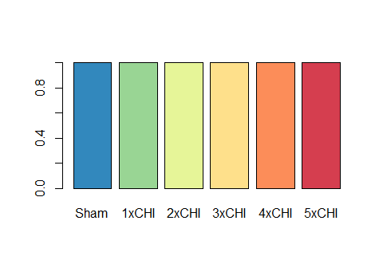
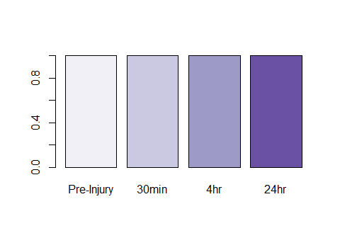

Bulk RNA sequencing for temporal profiling in repetitive mild traumatic
brain injury
================
Alyssa Pybus

This project is organized into four separate scripts: data
pre-processing/wrangling (Wrangle.R), a function to run analysis results
on a given subset of the data (Sample Subset.R), the main analysis
(22131-02 Analysis.R), and weighted gene coexpression network analysis
(WGCNA.R).

## Wrangle.R

Wrangle.R produces the following outputs for later use in the analysis:

- R data set of the filtered raw count matrix, metadata in matching
  order, and a data frame of the gene names and IDs
- R data set of sample protein values matrix, index of analyte columns
  within the protein data frame, greek character labels, and palettes
  for time and injury number
- R data get of gene sets for use in GSVA
- R data set of normalized, variance-stabilization gene expression

### Set-up

Clear out global environment, set working directory to current file
location (where your current script is saved), and load necessary
packages. You’ll need to install any packages you don’t already have
that are listed in p_load().

``` r
rm(list=ls())
setwd(dirname(rstudioapi::getActiveDocumentContext()$path))
pacman::p_load(tidyverse)
```

### Transcript data preparation

#### Load the metadata

The metadata will later be sorted to match the order of samples from the
data, so this variable has the suffix .us for “unsorted”.

``` r
# load in experiment data and metadata
metadata.us = readxl::read_excel("Data/22131-02 metadata.xlsx") %>%
  mutate(Injury = factor(Injury,levels=c("Sham","1xCHI","pre-3xCHI","3xCHI","pre-5xCHI","5xCHI")))

glimpse(metadata.us)
```

    ## Rows: 39
    ## Columns: 7
    ## $ Sample       <dbl> 213, 214, 217, 219, 221, 230, 237, 239, 242, 244, 247, 24~
    ## $ Admera       <chr> "22131R-02-01", "22131R-02-02", "22131R-02-03", "22131R-0~
    ## $ TimePoint    <dbl> 4.0, 24.0, 4.0, 0.5, 0.5, 0.0, 0.5, 0.5, 4.0, 4.0, 24.0, ~
    ## $ Injury       <fct> 3xCHI, 3xCHI, 3xCHI, 3xCHI, 3xCHI, Sham, 5xCHI, 5xCHI, 5x~
    ## $ AbsoluteTime <dbl> 52.0, 72.0, 52.0, 48.5, 48.5, 0.0, 96.5, 96.5, 100.0, 100~
    ## $ ExptDate     <dttm> 2019-11-07, 2019-11-08, 2019-11-07, 2019-11-07, 2019-11-~
    ## $ Round        <dbl> 1, 1, 1, 1, 1, 1, 1, 1, 1, 1, 1, 1, 1, 1, 1, 1, 1, 1, 2, ~

#### Load in and filter the count data

We use filter criteria to match recommendations for use in Weighted Gene
Co-expression Network Analysis (WGCNA): keep genes where at least 90%
have a raw count higher than 10.

Reference:
<https://horvath.genetics.ucla.edu/html/CoexpressionNetwork/Rpackages/WGCNA/faq.html>

``` r
count.in = rio::import("Data/22131-02-gene-count-all.csv")
gene.df.uf = count.in[,2:3]  # unfiltered gene names (non-unique) and EnsemblIDs (unique)
count.uf = count.in[,4:42]  # unfiltered gene counts
colnames(count.uf) = metadata.us$Sample
rownames(count.uf) = gene.df.uf$EnsemblID

# filter criteria as recommended on WGCNA FAQ (genes where 90% of samples have count >10)
keepInd=which(rowSums(count.uf>10) > {ncol(count.uf)*.9})
count.us = count.uf[keepInd,]   # unsorted columns (samples), filtered genes (rows)
gene.df = gene.df.uf[keepInd,]  # filtered genes (rows)

# sort by AbsoluteTime
metadata = dplyr::arrange(metadata.us,AbsoluteTime)  # sort sample metadata by ascending time point since first injury
sort_ind = match(metadata$Sample,metadata.us$Sample)
count <- count.us[,sort_ind]  # sort count matrix columns by ascending time point since first injury (match metadata tibble)

save(count,metadata,gene.df,file="R Data/genecounts.rda")  # save to access later

glimpse(count)
```

    ## Rows: 14,963
    ## Columns: 39
    ## $ `230` <dbl> 374.00, 84.00, 119.00, 19.95, 425.00, 637.00, 1724.05, 24.00, 47~
    ## $ `345` <dbl> 360.00, 247.00, 103.00, 16.10, 605.00, 1005.00, 2777.94, 33.00, ~
    ## $ `499` <dbl> 520.00, 75.00, 62.00, 27.36, 463.00, 651.00, 1889.89, 43.00, 547~
    ## $ `504` <dbl> 449.00, 66.00, 73.00, 14.56, 438.00, 595.00, 1688.77, 49.00, 489~
    ## $ `252` <dbl> 108.00, 447.00, 85.00, 51.53, 589.00, 616.00, 1596.11, 26.00, 53~
    ## $ `253` <dbl> 146.00, 325.00, 112.00, 21.88, 596.00, 733.00, 1920.44, 38.00, 6~
    ## $ `373` <dbl> 415.00, 65.00, 68.00, 19.75, 442.00, 825.00, 1953.97, 30.00, 470~
    ## $ `257` <dbl> 180.00, 194.00, 63.00, 52.86, 472.00, 671.00, 1881.46, 24.00, 46~
    ## $ `259` <dbl> 119.00, 317.00, 38.00, 31.49, 475.00, 584.40, 1516.48, 12.00, 35~
    ## $ `500` <dbl> 622.00, 75.00, 38.00, 19.75, 518.00, 750.69, 2056.65, 41.00, 570~
    ## $ `266` <dbl> 127.00, 273.00, 68.00, 16.70, 477.00, 608.00, 1467.54, 16.00, 40~
    ## $ `267` <dbl> 213.00, 299.00, 63.00, 22.93, 550.00, 755.00, 1690.47, 33.00, 46~
    ## $ `371` <dbl> 550.00, 94.00, 138.00, 19.91, 611.00, 991.64, 2839.09, 36.00, 68~
    ## $ `436` <dbl> 265.00, 158.00, 112.00, 20.62, 508.00, 710.86, 1857.06, 46.00, 6~
    ## $ `307` <dbl> 409.00, 62.00, 112.00, 22.69, 548.00, 877.00, 2221.39, 30.00, 46~
    ## $ `349` <dbl> 177.00, 334.00, 90.00, 38.86, 575.00, 839.00, 2074.67, 14.00, 62~
    ## $ `439` <dbl> 202.00, 157.00, 106.00, 20.78, 538.00, 699.00, 1745.63, 32.00, 5~
    ## $ `219` <dbl> 155.00, 219.00, 54.00, 45.32, 471.00, 625.00, 1440.52, 35.00, 52~
    ## $ `221` <dbl> 280.00, 142.00, 84.00, 27.66, 521.00, 688.00, 1900.35, 27.00, 51~
    ## $ `352` <dbl> 242.00, 163.00, 63.00, 22.82, 410.00, 646.00, 1702.49, 31.00, 47~
    ## $ `213` <dbl> 250.00, 100.00, 90.00, 54.81, 387.00, 602.00, 1482.48, 22.00, 40~
    ## $ `217` <dbl> 167.00, 194.00, 51.00, 25.42, 406.00, 637.00, 1510.55, 29.00, 36~
    ## $ `214` <dbl> 224.00, 132.00, 115.00, 20.75, 484.00, 674.76, 1705.42, 37.00, 5~
    ## $ `353` <dbl> 316.00, 97.00, 67.00, 20.76, 491.00, 654.00, 1900.94, 24.00, 373~
    ## $ `502` <dbl> 764.00, 44.00, 62.00, 27.81, 554.00, 891.00, 2362.52, 62.00, 627~
    ## $ `503` <dbl> 897.00, 97.00, 131.00, 28.11, 583.00, 928.00, 2619.60, 59.00, 64~
    ## $ `355` <dbl> 436.00, 65.00, 86.00, 24.43, 475.00, 642.00, 1795.91, 32.00, 456~
    ## $ `367` <dbl> 219.00, 113.00, 88.00, 19.65, 514.00, 692.00, 1894.17, 28.00, 41~
    ## $ `507` <dbl> 390.00, 77.00, 52.00, 20.61, 477.00, 743.00, 2050.14, 35.00, 545~
    ## $ `237` <dbl> 279.00, 88.00, 87.00, 35.63, 366.00, 611.00, 1477.70, 40.00, 446~
    ## $ `239` <dbl> 174.00, 127.00, 53.00, 15.58, 363.00, 571.00, 1407.30, 21.00, 38~
    ## $ `443` <dbl> 224.00, 200.00, 82.00, 18.76, 516.00, 657.00, 1662.07, 25.00, 50~
    ## $ `242` <dbl> 292.00, 148.00, 77.00, 33.33, 468.00, 627.97, 1624.30, 27.00, 52~
    ## $ `244` <dbl> 263.00, 254.00, 70.00, 21.78, 511.00, 643.00, 1930.56, 44.00, 54~
    ## $ `445` <dbl> 269.00, 99.00, 76.00, 46.59, 393.00, 624.00, 1479.34, 28.00, 500~
    ## $ `247` <dbl> 79.00, 231.00, 80.00, 24.02, 648.00, 783.00, 2090.47, 37.00, 548~
    ## $ `248` <dbl> 319.00, 188.00, 106.00, 49.46, 570.00, 729.70, 1799.68, 36.00, 4~
    ## $ `449` <dbl> 510.00, 84.00, 83.00, 28.25, 510.00, 804.00, 2054.44, 43.00, 525~
    ## $ `451` <dbl> 554.00, 69.00, 77.00, 26.01, 500.00, 868.00, 2241.19, 41.00, 605~

``` r
glimpse(metadata)
```

    ## Rows: 39
    ## Columns: 7
    ## $ Sample       <dbl> 230, 345, 499, 504, 252, 253, 373, 257, 259, 500, 266, 26~
    ## $ Admera       <chr> "22131R-02-06", "22131R-02-20", "22131R-02-35", "22131R-0~
    ## $ TimePoint    <dbl> 0.0, 0.0, 0.0, 0.0, 0.5, 0.5, 0.5, 4.0, 4.0, 4.0, 24.0, 2~
    ## $ Injury       <fct> Sham, Sham, Sham, Sham, 1xCHI, 1xCHI, 1xCHI, 1xCHI, 1xCHI~
    ## $ AbsoluteTime <dbl> 0.0, 0.0, 0.0, 0.0, 0.5, 0.5, 0.5, 4.0, 4.0, 4.0, 24.0, 2~
    ## $ ExptDate     <dttm> 2019-11-08, 2020-02-24, 2021-07-22, 2021-07-30, 2020-01-~
    ## $ Round        <dbl> 1, 2, 3, 3, 1, 1, 2, 1, 1, 3, 1, 1, 2, 2, 2, 2, 2, 1, 1, ~

``` r
glimpse(gene.df)
```

    ## Rows: 14,963
    ## Columns: 2
    ## $ EnsemblID <chr> "ENSMUSG00000051951", "ENSMUSG00000102331", "ENSMUSG00000025~
    ## $ geneName  <chr> "Xkr4", "Gm19938", "Sox17", "Gm6123", "Mrpl15", "Lypla1", "T~

### Protein data preparation

#### Load the protein data, filter, and subtract background

Load in the protein data, filter to just female frontal cortex samples
(bulk RNAseq was conducted on female sematomotor cortex, adjacent to the
frontal cortex where proteins were measured in the same animals), and
subtract background values.

``` r
# load protein data
df_in <- readxl::read_excel("Data/DoD TBI Acute All.xlsx") %>%
  dplyr::arrange(Region,AbsoluteTime) %>%
  dplyr::filter(Sex == "F") %>%  # Female samples only (RNAseq was only on female samples)
  dplyr::filter(Region == "FC")

# define the analytes to treat as numeric variables by setting first and last in range
first_analyte="GFAP"
last_analyte="TNF-a"
analyte_range={which(colnames(df_in)==first_analyte)}:{which(colnames(df_in)==last_analyte)}

#create array of average background for each analyte
df_b <- df_in %>%
  filter(Sample == "background") %>%
  dplyr::select(all_of(analyte_range)) %>%
  colMeans()

#create data frame of sample data
df_samples <- df_in %>%
  dplyr::filter(Sample != "background") %>%
  dplyr::filter(Sample %in% metadata$Sample) %>%
  mutate(Sample = as.numeric(Sample))

# Subtract background, set negative values to zero
df_samples[,analyte_range] <- sweep(df_samples[,analyte_range],2,df_b)
df_samples[df_samples<0] <- 0 # analytes below background set to zero

glimpse(df_samples)
```

    ## Rows: 39
    ## Columns: 61
    ## $ Sample         <dbl> 230, 345, 499, 504, 252, 253, 373, 257, 259, 500, 266, ~
    ## $ Sex            <chr> "F", "F", "F", "F", "F", "F", "F", "F", "F", "F", "F", ~
    ## $ Region         <chr> "FC", "FC", "FC", "FC", "FC", "FC", "FC", "FC", "FC", "~
    ## $ TimePoint      <dbl> 0.0, 0.0, 0.0, 0.0, 0.5, 0.5, 0.5, 4.0, 4.0, 4.0, 24.0,~
    ## $ Injury         <chr> "Sham", "Sham", "Sham", "Sham", "1xCHI", "1xCHI", "1xCH~
    ## $ AbsoluteTime   <dbl> 0.0, 0.0, 0.0, 0.0, 0.5, 0.5, 0.5, 4.0, 4.0, 4.0, 24.0,~
    ## $ ExptDate       <dttm> 2019-11-08, 2020-02-24, 2021-07-22, 2021-07-30, 2020-0~
    ## $ Person         <chr> "Rowan", "Rowan", "Lilly", "Lilly", "Rowan", "Rowan", "~
    ## $ `L hemi 3mm`   <dbl> 7.968402, 7.803006, 4.475424, 22.805000, 11.190377, 8.0~
    ## $ `L hemi 4.5mm` <dbl> 7.021518, 7.391256, 4.727163, 15.940735, 9.511138, 8.25~
    ## $ `R hemi 3mm`   <dbl> 14.858942, 3.894846, 11.781626, 18.078486, 12.394216, 8~
    ## $ `R hemi 4.5mm` <dbl> 8.362923, 4.855932, 11.479374, 12.630054, 10.973602, 7.~
    ## $ GFAP           <dbl> 68.74708, 91.70806, 42.11777, 74.58922, 190.75276, 211.~
    ## $ S100B          <dbl> 2.425512, 4.312970, 2.452475, 2.048020, 4.555644, 3.342~
    ## $ CD68           <dbl> 0.267, 0.341, 0.329, 0.307, 0.306, 0.356, 0.328, 0.337,~
    ## $ TMEM119        <dbl> 125.71266, 226.47431, 132.96750, 89.43847, 203.09761, 1~
    ## $ AB40           <dbl> 4.5, 5.5, 5.5, 4.5, 5.5, 7.5, 6.5, 5.5, 3.5, 6.0, 7.5, ~
    ## $ AB42           <dbl> 2.0, 3.0, 2.0, 3.0, 1.0, 3.5, 2.5, 2.0, 1.0, 3.0, 3.0, ~
    ## $ `AB42/40`      <dbl> 0.4444444, 0.5454545, 0.3636364, 0.6666667, 0.1818182, ~
    ## $ tTau           <dbl> 1288.0, 3490.5, 1771.0, 2092.0, 1961.0, 1781.0, 2581.5,~
    ## $ pTau           <dbl> 261.0, 602.5, 351.5, 385.5, 292.0, 334.0, 453.0, 355.5,~
    ## $ `pTau/tTau`    <dbl> 0.20263975, 0.17261137, 0.19847544, 0.18427342, 0.14890~
    ## $ pAtf2          <dbl> 21.5, 35.0, 17.0, 15.5, 9.0, 9.0, 31.5, 1.5, 10.5, 19.5~
    ## $ pMek1          <dbl> 50.5, 58.0, 26.5, 35.5, 15.5, 18.5, 50.5, 15.5, 20.0, 3~
    ## $ pJnk           <dbl> 1.5, 3.5, 1.5, 2.5, 3.5, 3.5, 1.5, 2.5, 4.5, 3.5, 1.5, ~
    ## $ `p-p90 RSK`    <dbl> 11.5, 12.0, 9.0, 7.0, 14.5, 14.0, 12.0, 11.5, 15.5, 10.~
    ## $ `p-p38`        <dbl> 1.5, 0.0, 0.0, 0.0, 0.0, 0.0, 0.0, 0.0, 1.0, 0.0, 0.0, ~
    ## $ `pErk1/2`      <dbl> 3.5, 5.5, 5.0, 2.5, 5.5, 3.5, 4.5, 3.0, 4.5, 2.5, 3.5, ~
    ## $ pHSP27         <dbl> 12.0, 8.0, 5.0, 5.0, 7.0, 8.0, 7.0, 8.0, 10.5, 6.0, 8.0~
    ## $ pStat3         <dbl> 14.5, 14.5, 5.0, 10.5, 9.5, 9.5, 12.5, 7.5, 14.5, 10.0,~
    ## $ `p-p53`        <dbl> 8.0, 6.5, 3.0, 0.0, 10.0, 9.0, 3.0, 5.0, 6.0, 4.0, 4.0,~
    ## $ `G-CSF`        <dbl> 1.5, 1.5, 0.0, 0.0, 0.5, 0.5, 1.5, 2.5, 1.5, 0.0, 2.5, ~
    ## $ Eotaxin        <dbl> 4.0, 4.0, 2.5, 5.0, 2.0, 2.0, 4.0, 6.0, 6.0, 3.0, 6.0, ~
    ## $ `GM-CSF`       <dbl> 0.0, 1.0, 0.0, 0.0, 1.0, 0.5, 1.0, 3.0, 0.0, 0.0, 1.0, ~
    ## $ `IFN-g`        <dbl> 1.5, 6.5, 0.0, 3.5, 3.5, 6.5, 4.5, 8.5, 1.5, 0.5, 3.5, ~
    ## $ `IL-1a`        <dbl> 59.0, 102.0, 36.0, 55.0, 33.0, 61.0, 44.0, 36.0, 27.0, ~
    ## $ `IL-1b`        <dbl> 6.5, 24.5, 6.0, 9.5, 7.5, 11.5, 12.5, 9.5, 5.5, 8.5, 6.~
    ## $ `IL-2`         <dbl> 385.0, 759.0, 426.0, 525.0, 359.0, 537.0, 648.5, 351.0,~
    ## $ `IL-4`         <dbl> 31.0, 52.0, 3.0, 16.0, 57.0, 50.0, 50.5, 53.0, 31.0, 9.~
    ## $ `IL-3`         <dbl> 2.0, 1.0, 0.0, 0.0, 1.0, 1.0, 1.0, 4.5, 1.0, 0.0, 1.0, ~
    ## $ `IL-5`         <dbl> 0, 0, 0, 0, 0, 0, 0, 0, 0, 0, 0, 1, 0, 0, 1, 0, 0, 0, 0~
    ## $ `IL-6`         <dbl> 0.0, 0.0, 0.0, 0.0, 0.0, 0.0, 0.0, 4.0, 4.5, 0.0, 0.0, ~
    ## $ `IL-7`         <dbl> 0.5, 0.5, 0.0, 0.0, 0.5, 1.5, 0.0, 1.5, 0.0, 0.0, 0.5, ~
    ## $ `IL-9`         <dbl> 83.5, 140.0, 45.5, 63.5, 106.5, 122.5, 84.5, 102.0, 63.~
    ## $ `IL-10`        <dbl> 2.0, 4.0, 1.0, 1.0, 2.0, 3.0, 2.0, 4.0, 2.0, 0.0, 4.0, ~
    ## $ `IL-12p40`     <dbl> 0.0, 1.5, 0.0, 0.0, 1.0, 1.0, 0.0, 4.0, 1.0, 0.0, 2.0, ~
    ## $ `IL-12p70`     <dbl> 0.5, 0.5, 0.0, 0.0, 0.5, 0.0, 0.0, 2.5, 0.5, 0.0, 0.5, ~
    ## $ LIF            <dbl> 0.5, 0.0, 0.0, 0.0, 0.0, 0.0, 0.0, 2.5, 0.5, 0.0, 0.0, ~
    ## $ `IL-13`        <dbl> 55.25, 179.25, 31.75, 64.75, 43.25, 69.75, 116.75, 57.7~
    ## $ LIX            <dbl> 26.0, 26.0, 20.0, 21.5, 26.0, 29.5, 24.5, 32.0, 27.0, 2~
    ## $ `IL-15`        <dbl> 1.5, 1.5, 0.0, 0.5, 1.5, 1.5, 1.5, 2.5, 0.5, 0.0, 2.5, ~
    ## $ `IL-17`        <dbl> 22.0, 77.5, 11.0, 33.5, 14.0, 43.5, 27.0, 17.0, 15.0, 2~
    ## $ `IP-10`        <dbl> 27.5, 83.5, 27.5, 39.0, 29.5, 37.5, 45.5, 119.0, 85.0, ~
    ## $ KC             <dbl> 7.0, 24.0, 2.0, 9.0, 4.0, 12.0, 11.0, 14.0, 16.0, 9.5, ~
    ## $ `MCP-1`        <dbl> 0.5, 3.5, 0.0, 1.5, 1.5, 0.5, 1.5, 2.0, 0.5, 0.5, 1.5, ~
    ## $ `MIP-1b`       <dbl> 0.0, 0.0, 0.0, 0.0, 0.0, 0.0, 0.0, 1.0, 0.0, 0.0, 0.0, ~
    ## $ `M-CSF`        <dbl> 1.0, 2.0, 0.0, 1.0, 2.0, 2.0, 2.0, 5.0, 2.0, 0.0, 2.0, ~
    ## $ `MIP-2`        <dbl> 2.0, 2.0, 1.0, 1.0, 1.0, 2.0, 1.0, 2.0, 1.0, 1.0, 2.0, ~
    ## $ MIG            <dbl> 1.5, 4.5, 1.5, 2.5, 2.5, 2.5, 0.5, 9.5, 15.5, 0.5, 7.5,~
    ## $ RANTES         <dbl> 3.5, 8.5, 0.5, 1.5, 5.0, 7.5, 5.5, 14.5, 3.5, 2.5, 5.5,~
    ## $ `TNF-a`        <dbl> 1.0, 1.0, 1.0, 0.5, 0.0, 1.0, 0.0, 3.0, 1.0, 0.0, 1.0, ~

#### Create unicode labels for greek characters

To enable the use of greek characters in figures (created in the main
analysis script) without complicating the column names of our sample
data frame, create a “greekversion” array to store unicode labels.

``` r
# create unicode labels for greek characters
greek = colnames(df_samples)
greek[which(greek=="AB40")] = "A\u03b240"
greek[which(greek=="AB42")] = "A\u03b242"
greek[which(greek=="AB42/40")] = "A\u03b242/40"
greek[which(greek=="tTau")] = "Total Tau"
greek[which(greek=="pTau")] = "Phospho-Tau T181"
greek[which(greek=="IFN-g")] = "IFN-\u03b3"
greek[which(greek=="IL-1a")] = "IL-1\u03b1"
greek[which(greek=="IL-1b")] = "IL-1\u03b2"
greek[which(greek=="MIP-1a")] = "MIP-1\u03b1"
greek[which(greek=="MIP-1b")] = "MIP-1\u03b2"
greek[which(greek=="TNF-a")] = "TNF-\u03b1"

greek[analyte_range]
```

    ##  [1] "GFAP"             "S100B"            "CD68"             "TMEM119"         
    ##  [5] "Aß40"             "Aß42"             "Aß42/40"          "Total Tau"       
    ##  [9] "Phospho-Tau T181" "pTau/tTau"        "pAtf2"            "pMek1"           
    ## [13] "pJnk"             "p-p90 RSK"        "p-p38"            "pErk1/2"         
    ## [17] "pHSP27"           "pStat3"           "p-p53"            "G-CSF"           
    ## [21] "Eotaxin"          "GM-CSF"           "IFN-<U+03B3>"     "IL-1a"           
    ## [25] "IL-1ß"            "IL-2"             "IL-4"             "IL-3"            
    ## [29] "IL-5"             "IL-6"             "IL-7"             "IL-9"            
    ## [33] "IL-10"            "IL-12p40"         "IL-12p70"         "LIF"             
    ## [37] "IL-13"            "LIX"              "IL-15"            "IL-17"           
    ## [41] "IP-10"            "KC"               "MCP-1"            "MIP-1ß"          
    ## [45] "M-CSF"            "MIP-2"            "MIG"              "RANTES"          
    ## [49] "TNF-a"

#### Create color bars for use in figures

For analyses that maintain the sample order used in df_samples, we
create a color bar for injury number and time point after injury. These
will be used to denote experimental groups in bar plots, heatmaps, and
other visualizations.

``` r
# create color bars for use in figures
InjPalette = rev(RColorBrewer::brewer.pal(6,"Spectral"))
TimePalette = RColorBrewer::brewer.pal(4,"Purples")

InjColors = case_when(
  df_samples$Injury=="Sham" ~ InjPalette[1],
  df_samples$Injury== "1xCHI" ~ InjPalette[2],
  df_samples$Injury== "pre-3xCHI" ~ InjPalette[3],
  df_samples$Injury== "3xCHI" ~ InjPalette[4],
  df_samples$Injury== "pre-5xCHI" ~ InjPalette[5],
  df_samples$Injury== "5xCHI" ~ InjPalette[6])

TimeColors = case_when(
  df_samples$TimePoint== 0 ~ TimePalette[1],
  df_samples$TimePoint== 0.5 ~ TimePalette[2],
  df_samples$TimePoint== 4 ~ TimePalette[3],
  df_samples$TimePoint== 24 ~ TimePalette[4],)

barplot(rep(1,length(InjPalette)),col=InjPalette,names.arg = c("Sham","1xCHI","2xCHI","3xCHI","4xCHI","5xCHI"))
```



``` r
barplot(rep(1,length(TimePalette)),col=TimePalette,names.arg = c("Pre-Injury","30min","4hr","24hr"))
```



#### Save protein data objects

``` r
save(df_samples,analyte_range,greek,InjPalette,TimePalette,InjColors,TimeColors,file="R Data/proteins.rda") #  save to access later
```

### Load and save gene sets for gene set variation analysis (GSVA)

Gene set variation analysis (GSVA) will be conducted on three
collections: the C2 collection from the Molecular Signatures Database
(MSigDB), custom curated annotations from astrocytes, and custom curated
annotations from neurons.

MSigDB: <https://www.gsea-msigdb.org/gsea/msigdb/human/collections.jsp>
Custom Sets:
<https://www.sciencedirect.com/science/article/pii/S0969996122000468>

``` r
# MSigDB c2
geneSetsIn=readxl::read_excel("Reference Files/c2.cp.v7.0.symbols.xlsx",col_names=FALSE) %>%
  dplyr::select(-2) %>%
  t() 
colnames(geneSetsIn) = geneSetsIn[1,]
gs_MSigDB_C2 = geneSetsIn[-1,] %>%
  as.data.frame() %>%
  as.list() %>%
  lapply(function(x) x[!is.na(x)])

# Astrocyte Annotations
gs_astro=readxl::read_excel("Reference Files/GeneSets_Astrocytes_FXN1.xlsx") %>%
  as.list() %>%
  lapply(function(x) x[!is.na(x)])

# Neuron Annotations
gs_neuron=readxl::read_excel("Reference Files/GeneSets_Neurons_FXN1.xlsx") %>%
  as.list() %>%
  lapply(function(x) x[!is.na(x)])

save(gs_MSigDB_C2,gs_astro,gs_neuron,file="R Data/gs.rda")
```

``` r
glimpse(gs_astro)
```

    ## List of 19
    ##  $ Signaling              : chr [1:207] "A2LD1" "A2ML1" "ADCY2" "ADCY8" ...
    ##  $ Protein Metabolism     : chr [1:85] "AADAT" "AASDH" "ADI1" "AGPHD1" ...
    ##  $ Mitochondria           : chr [1:130] "AASS" "ACAA2" "ACACB" "ACAD8" ...
    ##  $ Membrane               : chr [1:60] "ABCA1" "ABCB6" "ABCC9" "ABCD2" ...
    ##  $ Lipid Metabolism       : chr [1:55] "ABHD3" "ABHD5" "ACBD5" "ACBD7" ...
    ##  $ PAP                    : chr [1:97] "ABHD3" "ACAA2" "ACO2" "ACSBG1" ...
    ##  $ Plasticity             : chr [1:352] "ABI1" "ABI2" "ABLIM1" "ACVR2B" ...
    ##  $ Peroxisome             : chr [1:17] "ACOX1" "ACOX2" "CCBL2" "COG7" ...
    ##  $ General Metabolism     : chr [1:53] "ADAL" "AKR1C3" "AKR7A2" "ALDH1L1" ...
    ##  $ Gliotransmission       : chr [1:56] "ADHFE1" "ALDH4A1" "ALDH5A1" "ARNTL" ...
    ##  $ Gene Expression        : chr [1:219] "AEBP1" "ANP32E" "APITD1" "AQR" ...
    ##  $ Carbohydrate Metabolism: chr [1:34] "AGL" "ALDOC" "AMY1A" "AMY2A" ...
    ##  $ Hormone                : chr [1:34] "AGT" "ALDH1A1" "C12orf39" "CPQ" ...
    ##  $ Stress Response        : chr [1:72] "ALDH3A2" "ALDH7A1" "BPHL" "C10orf58" ...
    ##  $ Endomembrane System    : chr [1:99] "AMFR" "ASAP2" "ASAP3" "ATG7" ...
    ##  $ Vascular               : chr [1:6] "ANGPT1" "ANGPTL1" "F3" "F8" ...
    ##  $ Unknown                : chr [1:174] "ARL6IP6" "BAALC" "BROX" "C11orf1" ...
    ##  $ A1                     : chr [1:50] "LCN2" "C1S" "SERPING1" "C1R" ...
    ##  $ A2                     : chr [1:50] "DDX3Y" "IGFBP3" "LGALS3" "CLCF1" ...

``` r
glimpse(gs_neuron)
```

    ## List of 15
    ##  $ Neurotransmission            : chr [1:151] "AAK1" "ADCY1" "ADRA2A" "ADRBK2" ...
    ##  $ Protein Metabolism           : chr [1:29] "AASDHPPT" "C5orf25" "CCT8" "COPG2" ...
    ##  $ Membrane Potential Regulation: chr [1:87] "ABCC5" "ADD2" "ANKH" "ARPP21" ...
    ##  $ Metabolism                   : chr [1:88] "ABI3BP" "ACBD6" "ACOT7" "ACYP1" ...
    ##  $ Cytoskeleton                 : chr [1:49] "ACTN1" "ACTR3B" "ARHGAP20" "ARHGAP36" ...
    ##  $ Stress Response              : chr [1:116] "ACTR5" "ATG16L1" "BAG4" "BEX2" ...
    ##  $ Signaling                    : chr [1:134] "ACVR1B" "ACVR2A" "AGK" "AKAP11" ...
    ##  $ Neural Development           : chr [1:122] "ADAM22" "ADAM23" "AFF2" "ARX" ...
    ##  $ Gene Expression              : chr [1:170] "ADARB2" "AFF3" "ALKBH8" "ARID1B" ...
    ##  $ Unknown Function             : chr [1:124] "ADCK1" "ANKRD34A" "ARMCX4" "ARMCX5" ...
    ##  $ Endomembrane System          : chr [1:36] "ANKRD13C" "ANKRD50" "AP1S2" "BCAP29" ...
    ##  $ Miscellaneous                : chr [1:27] "AQP11" "CD200" "COL4A3BP" "FAM3C" ...
    ##  $ Mitochondria                 : chr [1:65] "ARMCX2" "ATP5H" "ATP5L" "ATPIF1" ...
    ##  $ Cell Adhesion                : chr [1:27] "CDH18" "CDH8" "CNST" "CNTNAP5" ...
    ##  $ Synaptic Plasticity          : chr [1:33] "CNKSR2" "CRH" "DCLK1" "EFNB3" ...

### Normalization and variance stabilization with DESeq2

#### Setup and load counts

``` r
rm(list=ls())   # clears "workspace"
setwd(dirname(rstudioapi::getActiveDocumentContext()$path))  # tells R that the folder where this code resides is our working directory
load("R Data/genecounts.rda")
```

#### Normalization

DESeq2 uses “median of ratios” method, as described here:
<https://hbctraining.github.io/DGE_workshop/lessons/02_DGE_count_normalization.html>

``` r
# DESeq2 Normalization 
des_mat = count %>%
  round(digits=0) %>%
  as.matrix()
metadata$AbsoluteTime=factor(metadata$AbsoluteTime)
dds <- DESeq2::DESeqDataSetFromMatrix(countData = des_mat,
                              colData = metadata,
                              design = ~ AbsoluteTime)
dds <- DESeq2::DESeq(dds)
```

#### Variance stabilizing transform

VST is recommended for WGCNA:
<https://horvath.genetics.ucla.edu/html/CoexpressionNetwork/Rpackages/WGCNA/faq.html>

VST in DESeq2:
<http://bioconductor.org/packages/devel/bioc/vignettes/DESeq2/inst/doc/DESeq2.html#variance-stabilizing-transformation>

``` r
# Variance Stabilizing Transform
vsd <- DESeq2::getVarianceStabilizedData(dds)
datExpr = t(vsd)

cleanDat = vsd
rownames(cleanDat) = str_c(gene.df$geneName,"|",rownames(vsd))

save(datExpr,cleanDat,metadata,gene.df,file="R Data/geneVSD.rda")
```
